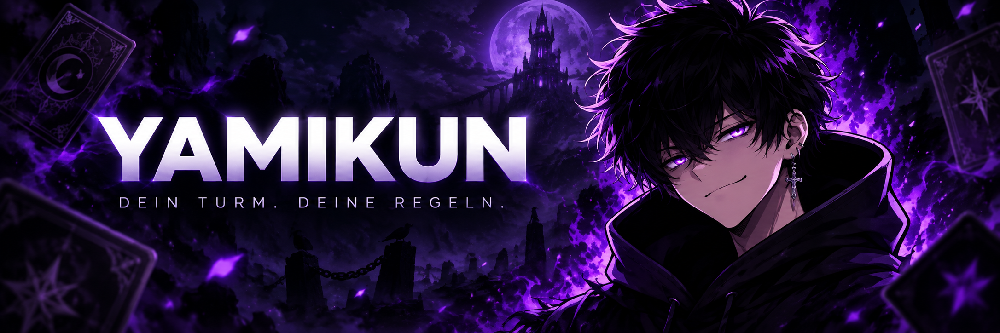
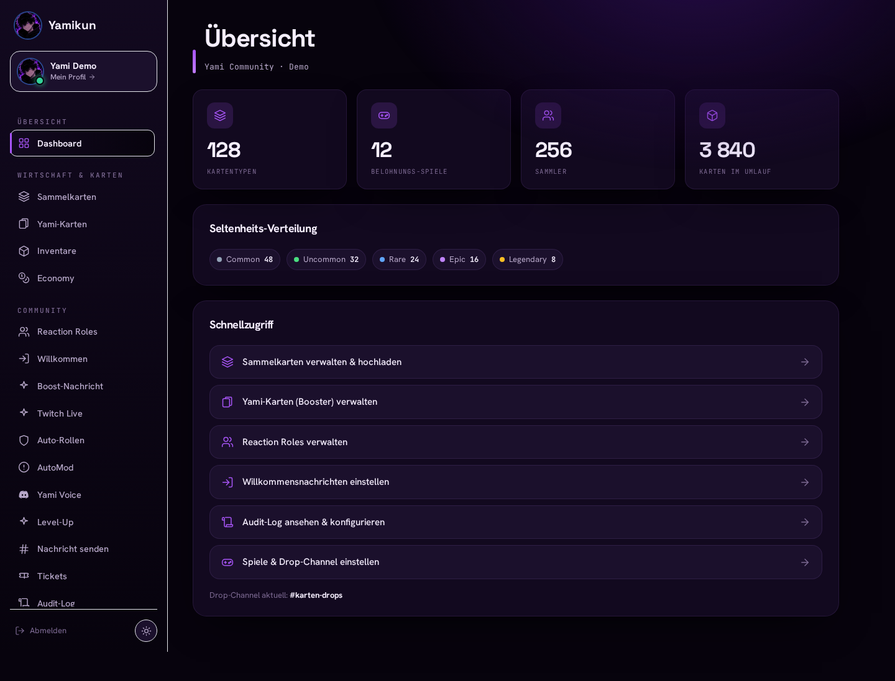

<p align="center">
  
</p>

<p align="center">
  <strong>Deine Community. Deine Karten. Dein Yami.</strong><br />
  Discord-Bot, Twitch-Chatbot und Webpanel für eine gemeinsame Community.
</p>

<p align="center">
  <a href="https://github.com/MGCrafter/yamikun/actions/workflows/checks.yml"></a>
  
  
  
  
</p>

<p align="center">
  <a href="#was-yami-kann">Features</a> ·
  <a href="#ein-blick-ins-webpanel">Webpanel</a> ·
  <a href="#lokal-starten">Installation</a> ·
  <a href="docs/deployment.md">CapRover</a> ·
  <a href="docs/twitch-chat.md">Twitch</a>
</p>

---

Yamikun verbindet Sammelkarten und gemeinsame Spielmomente mit den Werkzeugen,
die ein Discord-Server im Alltag braucht: Moderation, Tickets, Rollen und eigene
Voice-Channels. Admins verwalten ihren Server im Webpanel; Mitglieder finden dort
ihre Sammlung, ihr Profil und ihre Erfolge. Optional begleitet Yami die Community
auch im Twitch-Chat.

## Was Yami kann

| Bereich | Features |
| --- | --- |
| **Karten & Booster** | Spielbelohnungen, Sammel- und Yami-Karten, Booster, Tauschen und Fusion. Uploads werden automatisch für Discord als WebP optimiert. |
| **Economy & Leveling** | Globale Coins, XP, Level, Daily-Streaks, Shop, Titel und Leaderboards. |
| **Community** | Profile, Freundschaftsanfragen, Friendship-XP, Ehen, GIF-Interactions und LFG mit Join-Buttons. |
| **Achievements** | 32 Erfolge, sichtbare Quest-Ziele, geheime Erfolge und Vergleich mit Freunden. |
| **Games** | Coinflip, Blackjack, Slots und Roulette mit virtuellen Coins. |
| **Moderation & Support** | AutoMod, persistente Verwarnungen, Audit-Log und Tickets mit privaten Threads und Web-Transcripts. |
| **Server-Alltag** | Reaction Roles, Auto-Rollen, Welcome- und Boost-Nachrichten, Level-Up-Meldungen sowie YouTube-/RSS-Ankündigungen. |
| **Yami Voice** | Join-to-Create-Channels mit Besitzerwechsel, Sperren, Freigaben, User-Limit und automatischem Aufräumen. |
| **Twitch** | Discord-Live-Benachrichtigungen sowie optionaler Chatbot mit Social-Commands, Coins, Spielen, AutoMod und automatischen Nachrichten. |
| **Oaken Tower** | Alte Spielcodes pro Person automatisch ersetzen und 1v1-Runden mitzählen. |

**Ein Profil über mehrere Discord-Server:** Coins, XP, Karten, Booster,
Freundschaften und Achievement-Freischaltungen begleiten den User. Channels,
Rollen und Feature-Konfiguration bleiben serverbezogen. Details stehen in der
[Einrichtungsanleitung](docs/setup.md#server-übergreifendes-verhalten).

## Ein Blick ins Webpanel



*Screenshot der tatsächlichen Oberfläche mit fiktiven Beispieldaten.*

- **Für Admins:** Karten, Spiele, Rollen, Economy, Moderation und Server-Einstellungen.
- **Für Mitglieder:** eigenes Dashboard unter `/me` mit Sammlung, Fusion, Profil und Erfolgen.
- **Für Streamer:** Twitch-Anmeldung und Chatbot-Verwaltung unter `/twitch`.
- **Discord-Login:** Serverzugriff über „Server verwalten“; globale Verwaltungsaktionen sind an die konfigurierten Web-Owner gebunden.

## Lokal starten

Voraussetzungen: **Python 3.12**, **Node.js 22**, npm und eine Discord-Anwendung.

```bash
git clone https://github.com/MGCrafter/yamikun.git
cd yamikun

python3 -m venv .venv
source .venv/bin/activate
pip install -r requirements.txt

cp .env.example .env
npm ci --prefix frontend
npm run build --prefix frontend
```

In `.env` mindestens `DISCORD_TOKEN` setzen. Im Discord Developer Portal
**Message Content Intent** und **Server Members Intent** aktivieren und den Bot
mit den Scopes `bot` und `applications.commands` einladen. Für Spielbelohnungen
zusätzlich **Presence Intent** aktivieren und `PRESENCE_INTENT=1` setzen.

```bash
python bot.py
```

Das Webpanel lässt sich mit `WEB_ENABLED=1`, `WEB_BASE_URL`, `OAUTH_CLIENT_ID`
und `OAUTH_CLIENT_SECRET` aktivieren. Als Discord-OAuth-Redirect exakt
`<WEB_BASE_URL>/callback` hinterlegen. Alle Optionen stehen in
[`.env.example`](.env.example) und unter [Einrichtung & Konfiguration](docs/setup.md).

Die interaktive Befehlsübersicht findest du direkt in Discord über **`/help`**.

## Mit GitHub auf CapRover deployen

Das Repository enthält bereits `Dockerfile` und `captain-definition`.
Der Docker-Build erstellt das React-Frontend und bündelt es mit dem Python-Bot
in einem Container.

| CapRover-Einstellung | Wert |
| --- | --- |
| Repository | `https://github.com/MGCrafter/yamikun.git` |
| Branch | `main` |
| Captain Definition | `captain-definition` im Repository-Root |
| Container HTTP Port | `8080` |
| Persistent Directory | `/data` |
| Instanzen | `1` für den gemeinsamen Bot- und SQLite-Prozess |

**Einmal einrichten, danach per Push aktualisieren:** CapRover mit dem Repository
verbinden und den dort erzeugten Webhook in GitHub hinterlegen. Ab dann kann ein
Push auf `main` einen neuen Build auslösen. Die vollständige Anleitung inklusive
OAuth, Datenerhalt und manueller Tarball-Alternative steht in
[Deployment & Updates](docs/deployment.md).

> Das Repository allein aktiviert noch kein automatisches Deployment. Dafür ist
> die einmalige Verbindung zwischen CapRover und GitHub nötig. Der enthaltene
> GitHub-Workflow prüft Tests und Build; er deployt nicht.

## Projektstruktur

```text
.
├── bot.py                 Discord-Start und Cog-Loader
├── db.py                  SQLite, Schema und Migrationen
├── cogs/                  Discord-Features und Webserver-Einstieg
├── webpanel/              API-Routen, Middleware und Bildverarbeitung
├── twitch_chat/           Twitch-Chatbot, Commands und Datenspeicherung
├── frontend/              React, TypeScript, Vite und Tailwind
├── webassets/             Öffentliches Logo und Favicon
├── docs/                  Einrichtung, Deployment, Bilder und Archiv
├── scripts/               Checks, Backups und optionale Deploy-Pakete
├── tests/                 Automatisierte Python-Tests
├── .github/workflows/     GitHub-Prüfungen für Pushes und Pull Requests
├── .env.example           Konfigurationsvorlage ohne Zugangsdaten
├── Dockerfile             Frontend-Build und Python-Laufzeit
└── captain-definition     CapRover-Builddefinition
```

Lokale `.env`-Dateien, Datenbanken, Uploads, Backups, virtuelle Umgebungen und
Build-Ausgaben bleiben durch `.gitignore` außerhalb des Repositorys.
`.dockerignore` hält diese Dateien auch aus dem Docker-Build heraus.

## Entwickeln & prüfen

```bash
source .venv/bin/activate
pip install -r requirements-dev.txt
bash scripts/check.sh
```

Der Check führt Python-Kompilierung, `pytest`, die TypeScript-Prüfung und den
Produktionsbuild des Frontends aus. Dieselben Prüfungen laufen in
[GitHub Actions](https://github.com/MGCrafter/yamikun/actions/workflows/checks.yml).

[Entwicklungsanleitung](docs/development.md) ·
[Einrichtung](docs/setup.md) ·
[Deployment & Backups](docs/deployment.md) ·
[Twitch-Chatbot](docs/twitch-chat.md) ·
[Historische Dokumentation](docs/archive/README.md)
